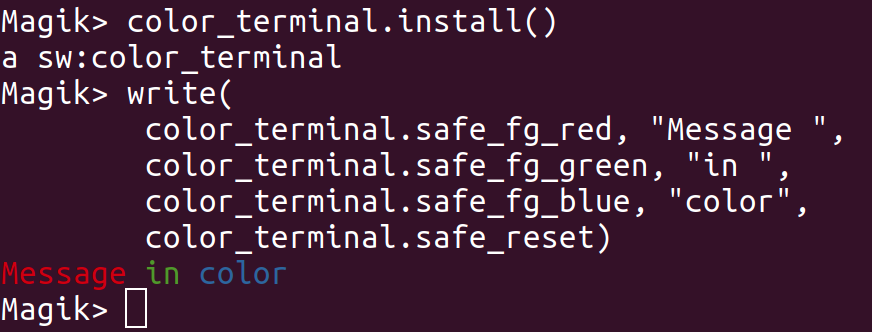

# SW5 Color terminal

Color support for your `!terminal!`! Use colors to improve readability of your console output.


## Installation

TL;DR: Load the file `load_me.magik`.

Steps to install/load:
1. Load this product: `smallworld_product.add_product(<path_to_this_product>)`
2. Load the module: `sw_module_manager.load_module(:sw5_color_terminal)`
3. Enable color support: `color_terminal.install()`


## Usage

To enable the color support in your terminal install the `color_terminal` by running: `color_terminal.install()`.

To write messages in color:
```
Magik> color_terminal.install()
Magik> write(
	color_terminal.safe_fg_red, "Message ",
	color_terminal.safe_fg_green, "in ",
	color_terminal.safe_fg_blue, "color",
	color_terminal.safe_reset)
```

Results in:


Use the `color_terminal.safe_...` methods instead of the `color_terminal.ansi_...` for easier use. No need to check whether the current terminal is a color supporting terminal, for example when using a remote_cli.


## Inner workings

On Windows, [ANSICON](https://github.com/adoxa/ansicon) is loaded to enable ANSI support for your console. On newer versions of Windows the terminal probably supports ANSI out of the box.

On non-Windows, your terminal will probably support ANSI out of the box. Nothing is loaded on installation.

[ANSI escape code](https://en.wikipedia.org/wiki/ANSI_escape_code)s are widely supported to control various parts of the terminal, including colors. The `color_terminal` exemplar contains several methods `ansi_...` methods containing ANSI escape codes.


## FAQ

Q: Does this work for files?
A: Probably not, YMMV.

Q: Does this work on Smallworld 4?
A: Maybe, YMMV.

Q: Does this work in combination with emacs/magik-mode?
A: Probably not, YMMV.


## License

Released under the GPLv3 license, see `LICENSE`.
